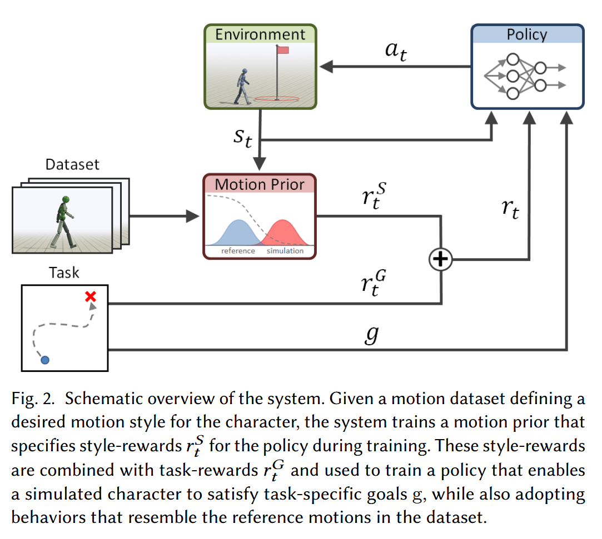

## AMP: Adversarial Motion Priors for Stylized Physics-Based Character Control

The paper proposes a framework called Adversarial Motion Priors (AMP), which guides physically simulated characters on what tasks to perform and in what motion styles to execute those tasks. The AMP algorithm enables characters to achieve high-level **task objectives** while mimicking the **motion styles** in the dataset. The framework leverages **Adversarial Imitation Learning**, training an adversarial discriminator with unstructured motion data samples to serve as a motion style prior, which guides a **reinforcement learning** algorithm to train physically simulated characters to compete various tasks.

***Contributions***: 
- **Adversarial Motion Prior Framework**: This Method combines goal-conditioned reinforcement learning with adversarial motion priors, enabling characters to learn from large unstructured motion datasets. It encourages characters to exhibit behaviors similar to those in the dataset while performing high-level tasks, such as achieving desired speeds or target points.
- **Techniques for stabilizing Adversarial Training**:
	- *Imitation from Observations*: Extending GAIL to setting where only states are observable, allowing the use of motion clips containing state information alone for training without requiring expert actions.
	- *Least-Squares Discriminator*: Employing the loss function of Least-Squares GAN (LSGAN) to address the gradient vanishing problem in standard GAN objectives.
	- *Discriminator Observation*: Mapping the observation data to extract generalized motion features, which are then fed into the discriminator. The advantage of this approach is that by extracting features from the observation , the discriminator can adapt to different tasks.
	- *Gradient Penalty*: Using gradient penalty to mitigate instability in adversarial training process, enhancing both training stability and performance.

