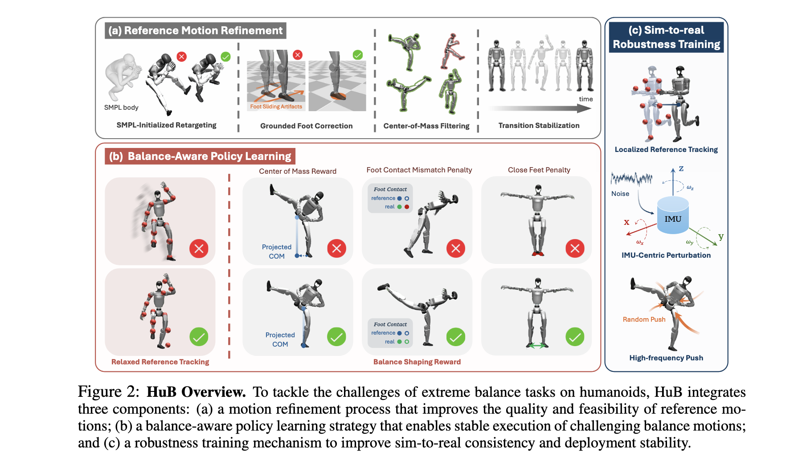
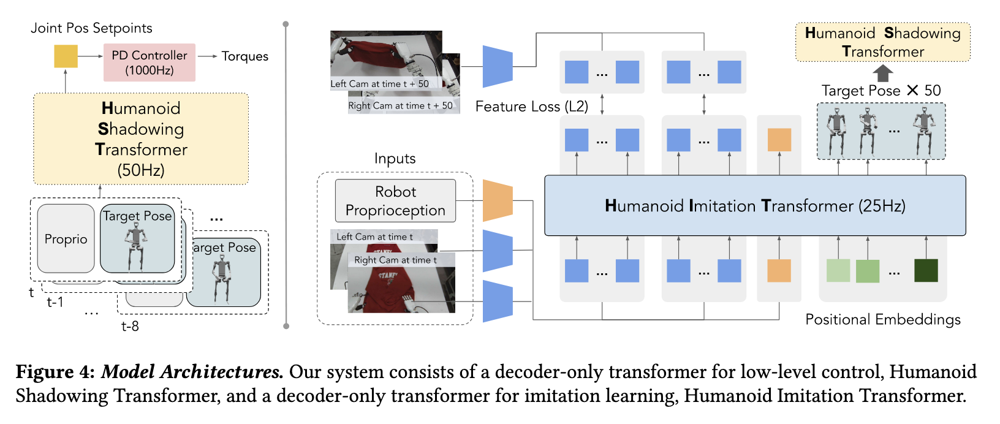

## HuB: Learning Extreme Humanoid Balance
This paper prensents HuB(**Hu**man **B**alance), a motion framework designed to tackle the diffculities encounted by humandoid robots when performing complex balance tasks. This framework comprises motion retargeting optimization, balance-aware policy learning, and Sim2Sim modules, with an engineering-focused approach.

***Contributions:***
- **Reference Motion Refinement**: The motion retargeting process is optimized using methods `SMPL-Initialized Retargeting`, `Grounded Foot Correction`, `Center-of-Mass Filtering` and `Transition Stabilization`.
- **Balance-Aware Policy Learning**: To promote more stable behaviors in robots, this paper adopt the method of `Relaxed Reference Tracking`. 
- **Sim-to-Real Robustness Training**: To address the noise issues in VIO, this paper establish a local coordinate frame on the robot's torso. Add `IMU-Centric Observation Perturbation` and `High-Frequency Push Disturbance` in domain randomation.

## HumanPlus: Humanoid Shadowing and Imitation from Humans

This paper introduces a whole-body teleoperation system named HumanPlus, designed to enable humanoid robots to learn motion and autonomous skills from human data. The system leverages human motion data to train low-level control policies (i.e., **Humanoid Shadowing Transformer**), allowing robots to follow whole-body motion of humans in real time. Through such shadowing and imitation, operators can teleoperate robots to collect data on various tasks in the real world. Subsequently, the collected data is used for supervised behavior cloning, training skill policies using **egocentric vision**, allowing humanoids to complete different tasks autonomously by imitating human skills.

***Contributions:***
- **Learning Shadow Imitation from Large-Scale Human Data:**  By leveraging large-scale human motion datasets (i.e., AMASS), low-level control policies (i.e., **Human Shadowing Transformer**) are trained using body &  hand pose estimation, retargeting, and reinforcement learning algorithms (i.e., PPO) . These low-level policies enable the collection of data for skill learning.
- **Learning Complex Autonomous Skills via Imitation Learning:**  A Transformer architecture combing action prediction and forward dynamics prediction (i.e. **Human Imitation Transformer**) is used to efficiently learn complex autonomous skills from a small number of demonstrations. 
- **Low-Cost, Real-Time Whole-body Teleoperation:** Whole-body Control of humanoid robots can be achieved using a single RGB camera, eliminating the need for expensive motion capture equipment.

